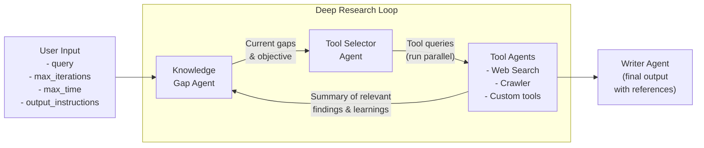

# Agentic Deep Research with OpenAI Agents SDK

An implementation of deep research built using the [OpenAI Agents SDK](https://github.com/openai/openai-agents-python) which can conduct iterative research on complex topics.

Written entirely in Python and can either be run as a python module or via the command line.

Compatible with any LLMs that use the OpenAI API specs.

## Overview

This deep research implementation is designed to perform in-depth research on any given topic. It employs a multi-agent architecture that:

1. Identifies knowledge gaps in the current research
2. Strategically selects the appropriate tools to fill those gaps
3. Executes research actions through specialized agents
4. Synthesizes findings into a comprehensive report

The system works iteratively, continually refining its understanding of the topic and producing increasingly detailed or expansive insights that feed the final report.

It is worth noting that the deep research agent does not ask clarifying questions at the start, so can be used in an automated fashion. Length and formatting of the final report can also be specified.

## Flow Diagram



## Architecture

The Deep Research Assistant is built with the following components:

### Core Components

- **DeepResearchManager**: Orchestrates the entire research workflow
- **LLM Client**: Manages interactions with language models

### Agent System

- **Knowledge Gap Agent**: Analyzes current research state and identifies gaps in knowledge
- **Tool Selector Agent**: Determines which tools to use for addressing specific knowledge gaps
- **Tool Agents**: Specialized agents for executing specific research actions (can be extended to add custom tools):
  - Web Search Agent
  - Website Crawler Agent
- **Writer Agent**: Synthesizes research findings into coherent reports

### Research Tools

- **Web Search**: Finds relevant information from SERP queries
  - Our implementation uses [Serper](https://www.serper.dev) to run Google searches by default, which requires an API key set to the `SERPER_API_KEY` env variable.
  - You can replace this with the native web search tool from OpenAI by setting the environment variable `USE_OPENAI_WEBSEARCH` to `true`
- **Website Crawler**: Extracts detailed content from the pages of a given website

### Implementing Custom Tool Agents

Tool agents are agents specialized in carrying out specific tasks using one or more tools (e.g. web searches, fetching and interpreting data from an API, etc). To implement a custom tool agent:
* Create any tools that the agent will use in the `app/tools` folder
* Create a new tool agent that calls this tool in the `app/agents/tool_agents` folder
* Add the tool agent definition to the `TOOL_AGENTS` variable in `app/agents/tool_agents/__init__.py`
* Update the system prompt of `app/agents/tool_selector_agent.py` to include the name and description of the new agent, so that the ToolSelectorAgent knows of its existence

### Configuring Custom LLMs

This repository is in theory compatible with any LLMs that follow the OpenAI API specs. This includes the likes of DeepSeek as well as models served through OpenRouter. However, the models need to be compatible with [Structured Outputs](https://platform.openai.com/docs/guides/structured-outputs) in the OpenAI API spec (i.e. being able to set `response_format: {type: "json_schema", ...}`).

LLMs are configured and managed in the `app/llm_client.py` file 

## Installation

1. Clone this repository:
   ```sh
   git clone https://github.com/qx-labs/agents-sdk-deep-research.git
   cd agents-sd-deep-research
   ```

2. Create and activate a virtual environment:
   ```sh
   python -m venv venv
   source venv/bin/activate  # On Windows: venv\Scripts\activate
   ```

3. Install dependencies:
   ```sh
   pip install -r requirements.txt
   ```

4. Create a `.env` file with your API keys:
   ```sh
   cp .env.example .env
   ```
   Then edit the `.env` file to add your OpenAI API key (or other API keys as needed).

## Usage

### Python Module

```python
# See example_usage.py for a full working example
import asyncio
from app.manager import DeepResearchManager

manager = DeepResearchManager(max_iterations=5, max_time_minutes=10)

query = "Provide a comprehensive background on quantum computing"

report = asyncio.run(
    manager.run(query, output_length="5 pages")
)
```

### Command Line

Run the research assistant from the command line:
```sh
python -m app.main --query "Your research topic" --max-iterations 5 --max-time 30 --output-length "5 pages"
```

### Parameters

- `--query`: The research topic or question (if not provided, you'll be prompted)
- `--max-iterations`: Maximum number of research iterations (default: 5)
- `--max-time`: Maximum time in minutes before the research loop auto-exits to produce a final output (default: 10)
- `--output-length`: Desired output length for the report (default: "5 pages")
- `--output-instructions`: Additional formatting instructions for the final report

## Trace Monitoring

If OpenAI models are used, the Deep Research assistant integrates with OpenAI's trace monitoring system. Each research session generates a trace ID that can be used to monitor the execution flow and agent interactions in real-time through the OpenAI platform.

## Observations and Limitations

* **Model Choice:** If using OpenAI models, we find that the `gpt-4o-mini` is as good if not better at tool selection than `o3-mini` (which is consistent with [this leaderboard](https://gorilla.cs.berkeley.edu/leaderboard.html)). Given the speed and cost benefits we therefore advise using `gpt-4o-mini` for the majority of agents in our workflow.
* **Output Length:** `gpt-4o` and similar models are not particularly good at following guidelines on output length beyond 1,000 words. We include an `output_length` parameter to give the user control (especially when responses shorter than 1,000 words are desired). Achieving much longer outputs would require us to modify the workflow to have individual agents drafting different sections of the report which are stitched together, and a final proof-reader agent refining the wording.

## Ways to Improve Speed and Output

- [ ] Introduce an initial planning agent before the research loop, which produces a task list that is actively maintained and updated during the research loop
- [ ] Add caching (e.g. Redis) of scraped web pages to avoid duplication
- [ ] Implement guardrails to nudge the researcher on from sub-topics that are already well covered
- [ ] Implement tool use tracking to prevent the researcher from calling the same tool across iterations (e.g. crawling the same website)
- [ ] Add more specialized research tools (academic paper search, data analysis)

## Author

Created by Jai Juneja at [QX Labs](https://www.qxlabs.com).