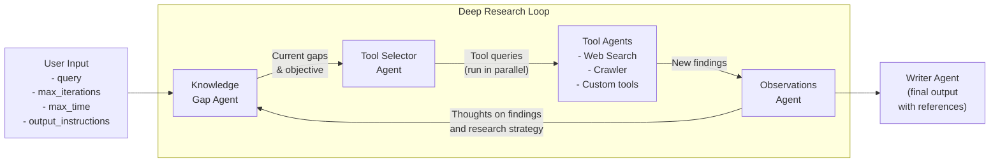
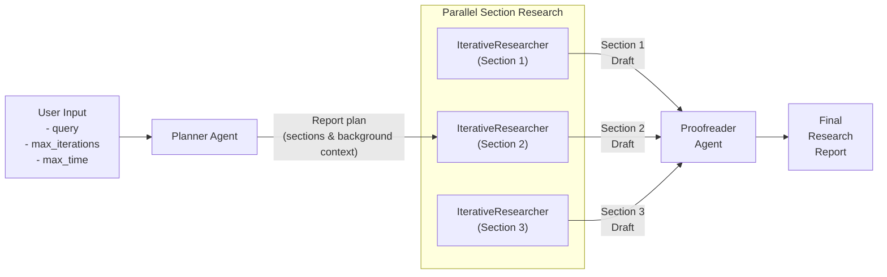

# Agentic Deep Research using the OpenAI Agents SDK

A powerful deep research assistant built using the [OpenAI Agents SDK](https://github.com/openai/openai-agents-python), designed to perform in-depth research on any given topic.

It uses a multi-agent architecture that works iteratively, continually refining its understanding of a topic and producing increasingly detailed insights that feed the final report.

Designed to be extedible to use custom tools and 3rd party LLMs compatible with the OpenAI API spec. When using OpenAI models, all LLM and tool calls are fully traced.

## Overview

This package has two modes of research:

- An `IterativeResearcher` which runs a continuous loop of research on a topic or sub-topic and drafts a report
  - This is preferred and sufficient for shorter reports (up to 5 pages / 1,000 words)
  - The user can specify constraints such as research depth, time limits, report length and formatting instructions
- A `DeepResearcher` which runs a more thorough and structured process, first forming a report outline, and then running concurrent `IterativeResearcher` instances for each section of the report
  - This is useful for longer reports (e.g. 20+ pages)

The flow of the `DeepResearcher` is as follows:

1. Takes a research topic and conducts preliminary research to form a report outline / plan
2. For each section of the report plan, runs parallel instances of the `IterativeResearcher`, which:
   1. Identifies knowledge gaps in the current research
   2. Strategically selects the appropriate tools to fill those gaps
   3. Executes research actions through specialized agents
   4. Synthesizes findings into a comprehensive section
3. Compiles all of the sections into a coherent and well-structured report

It is worth noting that the deep research agent does not ask clarifying questions at the start, so can be used in an automated fashion.

## Flow Diagram

### IterativeResearcher Flow



### DeepResearcher Flow



## Installation

### Using Pip

Install using `pip`:

```
pip install deep_research
```

Or clone the Github repo:

```sh
git clone https://github.com/qx-labs/agents-deep-research.git
cd agents-deep-research
pip install -r requirements.txt
```

Then create a `.env` file with your API keys:

```sh
cp .env.example .env
```

Edit the `.env` file to add your OpenAI, Serper and other settings as needed, e.g.:

```sh
OPENAI_API_KEY=<your_key>
SEARCH_PROVIDER=serper  # or set to openai
SERPER_API_KEY=<your_key>
```

## Usage

### Python Module

```python
# See the /examples folder for working examples
import asyncio
from deep_research import IterativeResearcher, DeepResearcher

# Run the IterativeResearcher for simple queries
researcher = IterativeResearcher(max_iterations=5, max_time_minutes=5)
query = "Provide a comprehensive overview of quantum computing"
report = asyncio.run(
    researcher.run(query, output_length="5 pages")
)

# Run the DeepResearcher for more lengthy and structured reports
researcher = DeepResearcher(max_iterations=3, max_time_minutes=5)
report = asyncio.run(
    researcher.run(query)
)

print(report)
```

### Command Line

Run the research assistant from the command line.

If you've installed via `pip`:
```sh
deep-research --mode deep --query "Provide a comprehensive overview of quantum computing" --max-iterations 3 --max-time 10
```

Or if you've cloned the Github repo:

```sh
python -m deep_research.main --mode deep --query "Provide a comprehensive overview of quantum computing" --max-iterations 3 --max-time 10
```

Parameters:

- `--query`: The research topic or question (if not provided, you'll be prompted)
- `--mode`: If `deep` uses the DeepResearcher, if `simple` uses the IterativeResearcher (default: deep)
- `--max-iterations`: Maximum number of research iterations (default: 5)
- `--max-time`: Maximum time in minutes before the research loop auto-exits to produce a final output (default: 10)
- `--output-length`: Desired output length for the report (default: "5 pages")
- `--output-instructions`: Additional formatting instructions for the final report

Boolean Flags:

- `--verbose`: Prints the research progress to console
- `--tracing`: Traces the workflow on the OpenAI platform (only works for OpenAI models)

## Architecture

The Deep Research Assistant is built with the following components:

### Core Components

- **IterativeResearcher**: Orchestrates the iterative research workflow on a single topic or subtopic
- **DeepResearcher**: Orchestrates a deeper and broader workflow that includes an initial report outline, calling of multiple parallel `IterativeResearch` instances, and final proofreading step
- **LLM Client**: Manages interactions with language models so that these can be swapped out as needed

### Agent System

- **Knowledge Gap Agent**: Analyzes current research state and identifies gaps in knowledge
- **Tool Selector Agent**: Determines which tools to use for addressing specific knowledge gaps
- **Tool Agents**: Specialized agents for executing specific research actions (can be extended to add custom tools):
  - Web Search Agent
  - Website Crawler Agent
- **Writer Agent**: Synthesizes research findings into coherent reports

### Research Tools

- **Web Search**: Finds relevant information from SERP queries
  - Our implementation uses [Serper](https://www.serper.dev) to run Google searches by default, which requires an API key set to the `SERPER_API_KEY` env variable.
  - You can replace this with the native web search tool from OpenAI by setting the environment variable `SEARCH_PROVIDER` to `openai`
- **Website Crawler**: Extracts detailed content from the pages of a given website

### Implementing Custom Tool Agents

Tool agents are agents specialized in carrying out specific tasks using one or more tools (e.g. web searches, fetching and interpreting data from an API, etc). To implement a custom tool agent:
* Create any tools that the agent will use in the `app/tools` folder
* Create a new tool agent that calls this tool in the `app/agents/tool_agents` folder
* Add the tool agent definition to the `TOOL_AGENTS` variable in `app/agents/tool_agents/__init__.py`
* Update the system prompt of `app/agents/tool_selector_agent.py` to include the name and description of the new agent, so that the ToolSelectorAgent knows of its existence

### Configuring Custom LLMs

This repository is in theory compatible with any LLMs that follow the OpenAI API specs. This includes the likes of DeepSeek as well as models served through OpenRouter. However, the models need to be compatible with [Structured Outputs](https://platform.openai.com/docs/guides/structured-outputs) in the OpenAI API spec (i.e. being able to set `response_format: {type: "json_schema", ...}`).

LLMs are configured and managed in the `app/llm_client.py` file 

## Trace Monitoring

If OpenAI models are used, the Deep Research assistant integrates with OpenAI's trace monitoring system. Each research session generates a trace ID that can be used to monitor the execution flow and agent interactions in real-time through the OpenAI platform.

## Observations and Limitations

### **Model Choice:** 

- If using OpenAI models, we find that the `gpt-4o-mini` is as good if not better at tool selection than `o3-mini` (which is consistent with [this leaderboard](https://gorilla.cs.berkeley.edu/leaderboard.html)). Given the speed and cost benefits we therefore advise using `gpt-4o-mini` as the model for the majority of agents in our workflow, with `o3-mini` for planning tasks and `gpt-4o` for final writing.
- Some 3rd party agents such as DeepSeek require much clearer instructions about the output instructions even when an output schema is specified. You may run into parser errors when using these models and will need to update the agents' system prompts accordingly.

### **Output Length:** 

LLMs are not good at following guidelines on output length. You typically run into two issues:

- LLMs are bad at counting. When giving length instructions, it's better to provide a reference that the model will be familiar with from its training data (e.g. 'length of a tweet', 'a few paragraphs', 'length of a book') rather than a specific word count. 
- Even though the output token limit on many of these models is massive, it is very difficult to get them to produce more than 1-2,000 words per response. There are methods such as [this one](https://medium.com/@techsachin/longwriter-using-llm-agent-based-pipeline-to-scale-llms-output-window-size-to-10-000-words-33210d299e2b) to produce longer outputs.

We include an `output_length` parameter for the `IterativeResearcher` to give the user control but bear in mind the above limitations.

## TODOs:

- [ ] Add compatibility with other search providers (e.g. Bing, Tavily, DuckDuckGo etc.)
- [ ] Add caching (e.g. Redis) of scraped web pages to avoid duplicate work/calls
- [ ] Add more specialized research tools (e.g. Wikipedia, arXiv, data analysis etc.)
- [ ] Add PDF parser
- [ ] Add integration / RAG for local files

## Author

Created by Jai Juneja at [QX Labs](https://www.qxlabs.com).